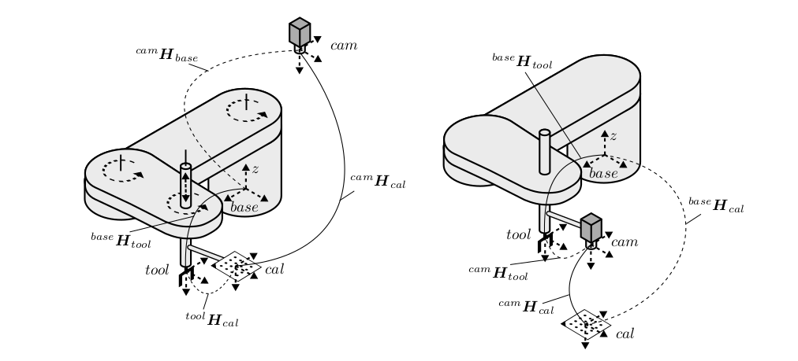

# handeye-4dof: Handeye Calibration for 4DOF Manipulators

<p align="center">

<br>
<em> Figure 1. Handeye calibration for 4DOF SCARA arms [1]. Left is eye-on-base and right is eye-on-hand. </em>
</p>

This package is an improvised ROS2 wrapper for the handeye-4dof algorithm that this is forked from.

This package provides eye-on-hand handeye calibration for 4DOF robot manipulators using dual quaternions. This is an implementation of [1] which extended dual quaternion handeye calibration techniques [2] to 4DOF robots. Handeye calibration through dual quaternions is favorable as it allows for us to solve for translation and rotation simultaneously, thus avoiding any compounding error resultant from solving these separately.
## Background

Robot handeye calibration is an important and well studied problem that allows us to obtain the unknown static transformation between the end effector and camera (*in eye-on-hand case*) or the robot base and camera (*in eye-on-base case*). This is done by sampling several transformations between the base and end effector (*through forward kinematics*) and camera to marker (*through marker detection methods*) which allows us to formulate the [**AX = XB**](https://en.wikipedia.org/wiki/Hand_eye_calibration_problem) problem where **X** is our unknown desired static transform.

Several methods exist to solve for **X** but a vast majority of these methods assume that the robot is well articulated (i.e. has 6DOF). For 4DOF robots such as SCARAs (x, y, z, yaw), conventional calibration methods are infeasible and are incapable of producing valid results. This method circumvents this problem by reducing [2] to 4DOF robots. See [1] for further details. For an introduction to dual quaternions, see [3].

## How to run
To run, first install necessary packages.
```bash
python3 -m pip install -r requirements.txt
```
The expected format for poses are an input of geometry_msgs.msg.PoseArray. There is a helper function to convert the input pose into 4x4 matrices. The calculated result will then be published 

subscribers:

base_to_robot (geometry_msgs.msg.PoseArray)

camera_to_marker (geometry_msgs.msg.PoseArray)

publishers:

calibrated_pose (geometry_msgs.msg.Pose)

services:

calculate_calibration (std_srvs.srv.Empty)


Afterwards, the node can be run by running the command shown below. 

```bash
colcon build --symlink-install && . install/setup.bash
ros2 run handeye_4dof_ros2 handeye_4dof_node
```

## TODO
If you would like to contribute by implementing any of the tasks below or you spot an error in the existing code base, feel free to submit a pull request!

- Add eye-on-base functionality **(major update)**.
- Improve README documentation.
- Add ROS capabilities.
- Add graphical visualizations / GUI.
- ~~Add command line interface.~~
- ~~Add post nonlinear refinement.~~
- ~~Add singular value checking.~~
- Add pose selection based off of dual quaternion scalar score *(tried but not working)*.
- Add details for z-translation obtainment.
- Add code comments throughout.

## References
[1] Ulrich, Markus. “Hand-Eye Calibration of SCARA Robots.” (2014).

[2] Daniilidis, Kostas. “Hand-Eye Calibration Using Dual Quaternions.” The International Journal of Robotics Research 18 (1999): 286 - 298.

### Dual Quaternion Guide
[3] Kenwright, Ben. “A Beginners Guide to Dual-Quaternions: What They Are, How They Work, and How to Use Them for 3D Character Hierarchies.” WSCG 2012 (2012).


